# dSound

## I. Set Up
### 1. Clone project
```
  git clone git@github.com:DAMHONGDUC/dSound.git
```
### 2. Install packages
- Open terminal in project folder and run:
```
  yarn install
```

### 3. Run app
- Open terminal in project folder and run these command:
```
  yarn start
```
```
  yarn android
```

## II. Tech stack
- React Native
- Firebase
- React Native Track Player
- Zing Mp3 API

## III. Release
- Android [apk](RELEASE/install/dsound.apk)
- [Google Play](https://play.google.com/store/apps/details?id=com.dsound)
- iOS (not available)
- App Store (not available)

## IV. Features
- Register account(Google, Facebook), Sign In, Sign Out
- Play music (previous, play/pause, next)
- Shuffle mode, Repeat mode

## V. Screenshots

<kbd>
  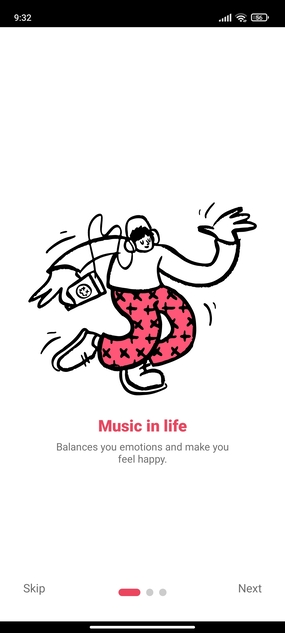
   &nbsp;&nbsp;&nbsp;&nbsp;&nbsp;&nbsp;&nbsp;&nbsp;
  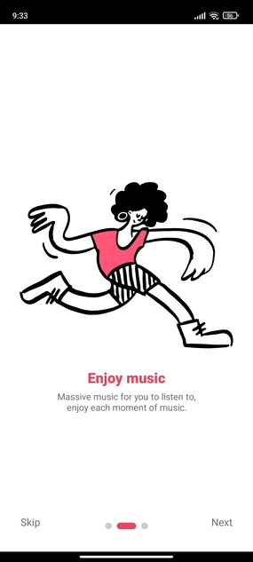
</kbd>
<br/>
<br/> 
       
<kbd>
  
   &nbsp;&nbsp;&nbsp;&nbsp;&nbsp;&nbsp;&nbsp;&nbsp;
  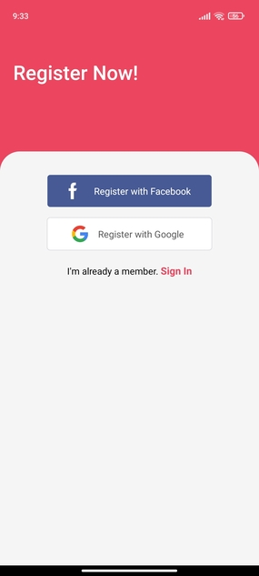
</kbd>
<br/>
<br/> 

<kbd>
  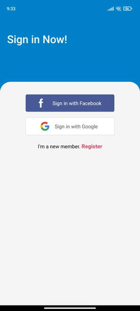
   &nbsp;&nbsp;&nbsp;&nbsp;&nbsp;&nbsp;&nbsp;&nbsp;
  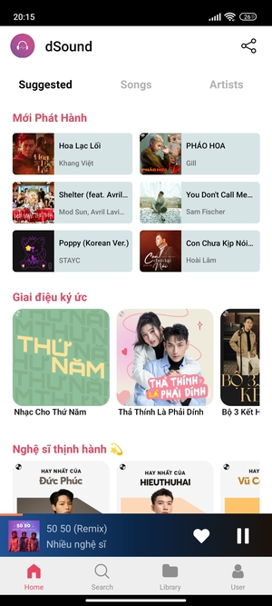
</kbd>
<br/>
<br/> 

<kbd>
  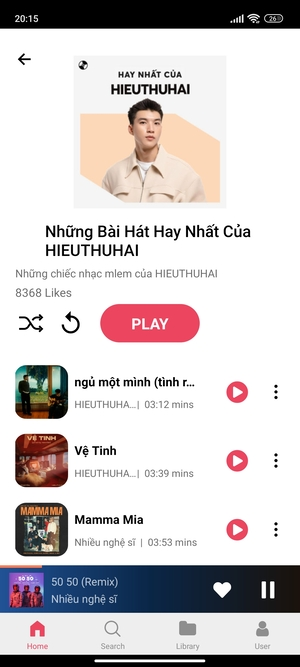
   &nbsp;&nbsp;&nbsp;&nbsp;&nbsp;&nbsp;&nbsp;&nbsp;
  
</kbd>
<br/>
<br/> 


<kbd>
   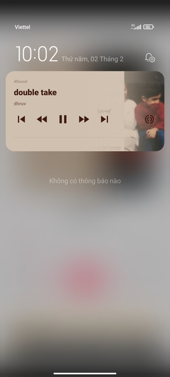
   &nbsp;&nbsp;&nbsp;&nbsp;&nbsp;&nbsp;&nbsp;&nbsp;
   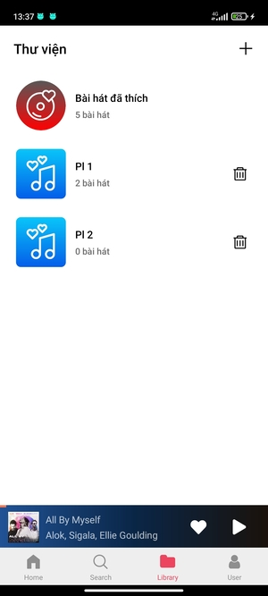
</kbd>

<kbd>
  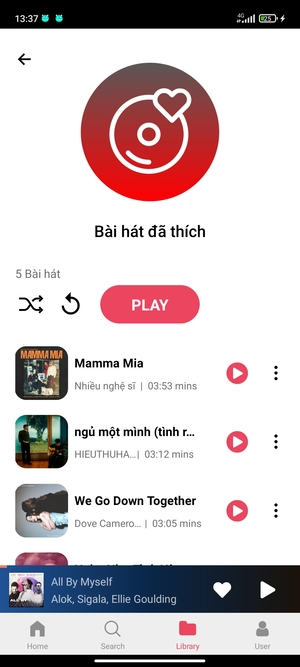
   &nbsp;&nbsp;&nbsp;&nbsp;&nbsp;&nbsp;&nbsp;&nbsp;
  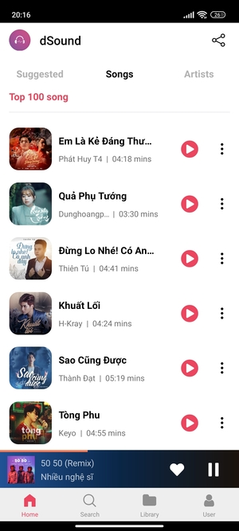
</kbd>
<br/>
<br/> 

<kbd>
  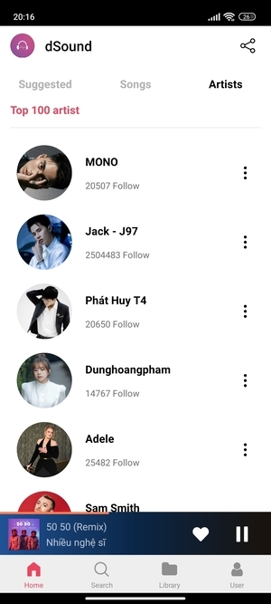
</kbd>
<br/>
<br/> 
