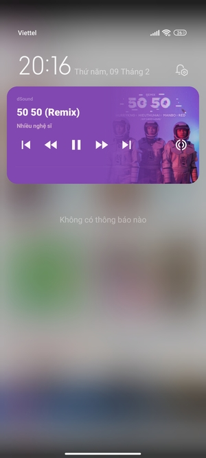

# dSound

## I. Set Up
### 1. Clone project
```
  git clone git@github.com:DAMHONGDUC/dSound.git
```
### 2. Install packages
- Open terminal in project folder and run:
```
  yarn install
```

### 3. Run app
- Open terminal in project folder and run these command:
```
  yarn start
```
```
  yarn android
```
## II. Struct

├── android
│   ├── app
│   ├── build
│   └── gradle
├── ios
│   ├── dSound
│   ├── dSoundTests
│   └── dSound.xcodeproj
├── RELEASE
│   ├── Images
│   └── install
├── src
│   ├── api
│   ├── assets
│   ├── components
│   ├── constants
│   ├── helper
│   ├── navigation
│   ├── redux
│   ├── screens
│   └── services
└── __tests__


## III. Features
- Register account(Google, Facebook), Sign In, Sign Out
- Play music (previous, play/pause, next)
- Shuffle mode, Repeat mode

## IV. Tech stack
- React Native
- Firebase
- React Native Track Player
- Zing Mp3 API

## V. Release
- Android [apk](RELEASE/install/dsound.apk)
- [Google Play](https://play.google.com/store/apps/details?id=com.dsound)
- iOS (not available)
- App Store (not available)

## VI. Screenshots

<kbd>
  
   &nbsp;&nbsp;&nbsp;&nbsp;&nbsp;&nbsp;&nbsp;&nbsp;
  
</kbd>
<br/>
<br/> 
       
<kbd>
  
   &nbsp;&nbsp;&nbsp;&nbsp;&nbsp;&nbsp;&nbsp;&nbsp;
  
</kbd>
<br/>
<br/> 

<kbd>
  
   &nbsp;&nbsp;&nbsp;&nbsp;&nbsp;&nbsp;&nbsp;&nbsp;
  
</kbd>
<br/>
<br/> 

<kbd>
  
   &nbsp;&nbsp;&nbsp;&nbsp;&nbsp;&nbsp;&nbsp;&nbsp;
  
</kbd>
<br/>
<br/> 


<kbd>
   
   &nbsp;&nbsp;&nbsp;&nbsp;&nbsp;&nbsp;&nbsp;&nbsp;
   
</kbd>

<kbd>
  
   &nbsp;&nbsp;&nbsp;&nbsp;&nbsp;&nbsp;&nbsp;&nbsp;
  
</kbd>
<br/>
<br/> 

<kbd>
  
</kbd>
<br/>
<br/> 
